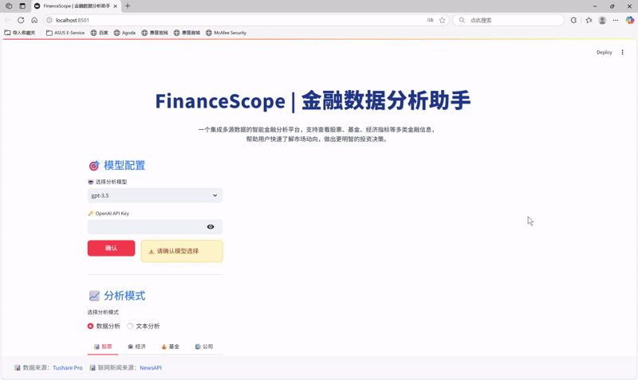
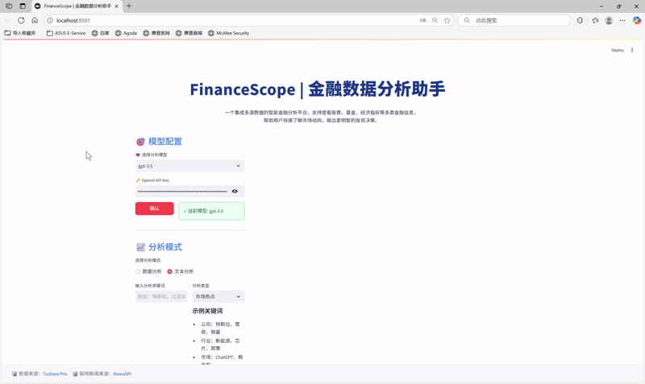
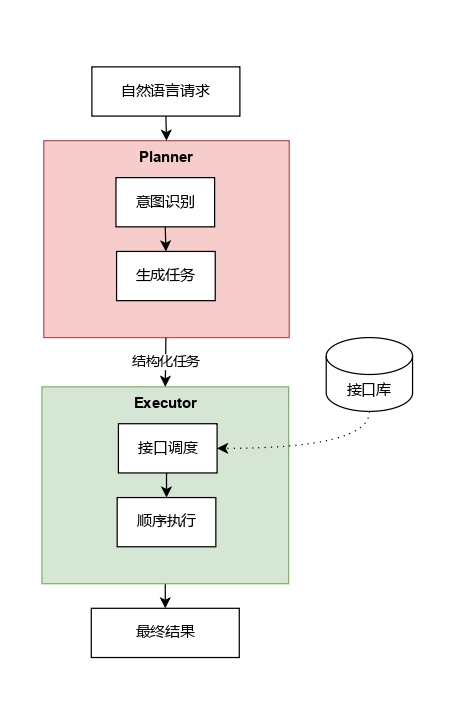
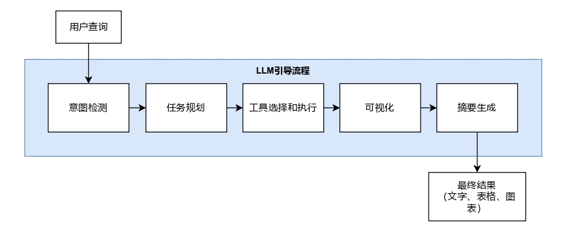
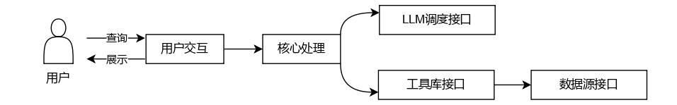

# Finance-Scope 📈

## 🚀 Project Overview

FinanceScope is an intelligent multi-source financial data analysis and visualization system powered by Large Language Models (LLMs). This system enables users to interact with financial data through natural language queries while providing comprehensive analytical insights and rich visualizations.

🚩 [中文 README](./README.md)  

📑 [Read the Thesis (PDF)](https://drive.google.com/file/d/10f9GF0twI1ypuXm9Cj1tWsNy3drIIxjF/view?usp=drive_link)  

▶️ [Watch Demo 1 (MP4)](./demo1.mp4)  

▶️ [Watch Demo 2 (MP4)](./demo2.mp4) 

---

## ✨ Key Features

| Feature | Description |
|---------|-------------|
| 🤖 Multi-Model Support | Switch between GPT-3.5 / Qwen-72B-Chat / DeepSeek-R1 / Fin-R1 with one click |
| 💬 Natural Language Query | Query financial data via natural language |
| 📊 Multi-Source Data | Covers stocks, funds, financial reports, macro indicators, and news sentiment |
| 🎨 Rich Visualizations | Line charts, candlesticks, heatmaps, pie charts, and more |
| 🎯 User-Friendly UI | Intuitive web interface for seamless interaction |

---

## 📸 Demo

### Financial Data Analysis:


### Financial Text Analysis:


---

## 📦 Installation & Deployment

1. **Clone the repository**
    ```bash
    git clone https://github.com/winggotayy/Finance-Scope.git
    cd Finance-Scope
    ```

2. **Install dependencies**
    Python version: 3.8
    ```bash
    pip install -r requirements.txt
    ```

3. **Run locally**
    ```bash
    python main.py
    ```

    **Set your LLM API keys before running:**

- For **GPT** models, configure your OpenAI key in `main.py`:
    ```bash
    openai_key = os.getenv("OPENAI_KEY")
    ```

- For **Fin-R1, Qwen-72B-Chat, and DeepSeek**, set API keys in `lab_llms_call.py`:
    ```bash
    dashscope.api_key='<您的 API 密钥>'
    ```

    **Also set your Tushare and NewsAPI tokens before running:**

- In `tool.py` (Tushare):  
    ```bash
    tushare_token = os.getenv('TUSHARE_TOKEN')
    pro = ts.pro_api(tushare_token)
    ```

- In `text_web.py` (NewsaAPI)：
    
    ```bash
    newsapi_key = os.getenv('NEWSAPI_KEY')
    ```

4. **Streamlit Web Interface**
    ```bash
    streamlit run app.py
    ```

## 🌐 API Registration Links

### LLM APIs

| Model/Platform | Registration Link | Notes |
|:---------|:---------|:-----|
| **OpenAI GPT** | [OpenAI API](https://platform.openai.com/) | Sign up to obtain API key |
| **Alibaba Bailian** | [Alibaba Bailian](https://bailian.console.aliyun.com/) | Provides Qwen and DeepSeek models |
| **Fin-R1** | [Gitee AI Platform](https://ai.gitee.com/) | Access via official events |

### Financial Data APIs

| API 名称 | 申请链接 | 说明 |
|:---------|:---------|:-----|
| **Tushare Pro** | [Tushare Pro](https://tushare.pro/) | Free registration with basic token access |
| **NewsAPI** | [NewsAPI](https://newsapi.org/) | Global news data including financial news |

---

## 🎯 Usage

1. **Choose LLM model and analysis mode**
   - Models: GPT-3.5, DeepSeek, Qwen-72B-Chat, Fin-R1
  - Modes: Data Analysis, Text Analysis
  
2. **Submit a natural language query**
   - Data Analysis: Query structured financial data
  - Text Analysis: Search news and reports with keywords

3. **View results**
   - Summaries
  - Tables
  - Visual charts

4. **Try built-in sample queries**
   - Explore system capabilities
  
5. **Export results. Download full reports for later use**

---

## 🏗 System Architecture & Workflow

FinanceScope adopts a layered design. LLMs parse user intent and orchestrate multiple modules to complete financial analysis and visualization.

### Plan & Execute
<div align="center">



</div>

The **Planner** component interprets user intent and generates structured task plans, while the **Executor** executes them sequentially.

### Core Workflow
<div align="center">



</div>

From natural language query to structured intent recognition, task planning, tool execution, visualization, and summarization — a full pipeline delivers multimodal outputs.

### Modular Design
<div align="center">



</div>

Key modules include the LLM orchestration interface, tool libraries, and data source APIs, all coordinated through unified interfaces.

---

## 🙏 Acknowledgements

This project is inspired by [zwq2018/Data-Copilot](https://github.com/zwq2018/Data-Copilot). On top of it, FinanceScope focuses on **financial applications**, introducing **domain-specific enhancements, technical extensions, and feature-rich improvements**.

Special thanks to the Data-Copilot open-source community.