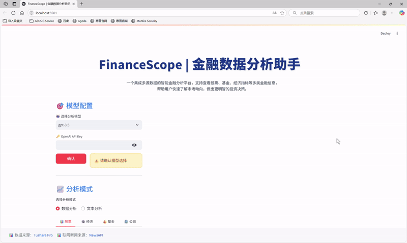
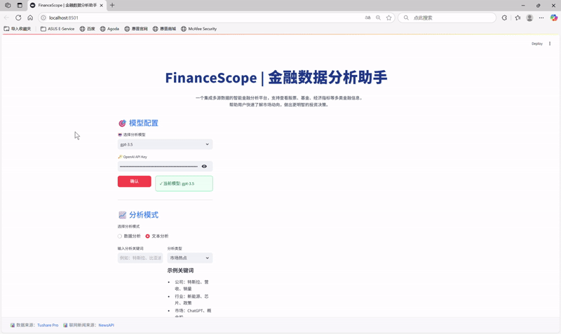
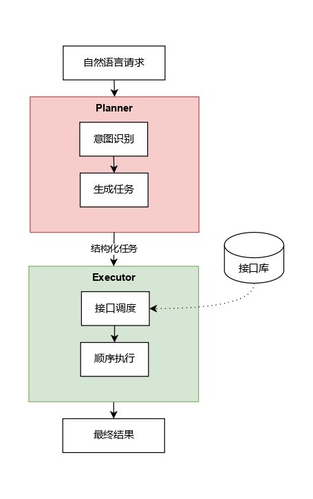
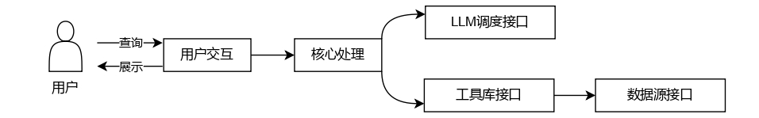

# FinanceScope 📈

## 🚀 项目概述

FinanceScope 是一个基于大语言模型(LLM)的智能多源金融数据分析及可视化系统。该系统允许用户通过自然语言查询与金融数据交互，同时提供全面的分析洞察和丰富的可视化展示。

---

## ✨ 核心特性

| 功能 | 说明 |
|------|------|
| 🤖 多模型兼容 | GPT-3.5 / Qwen-72B-Chat / DeepSeek-R1 / Fin-R1 一键切换 |
| 💬 自然语言交互 | 通过对话式AI查询金融数据
| 📊 多源数据 | 股票、基金、财报、宏观、新闻情感全覆盖 |
| 🎨 丰富可视化 | 折线、K 线、热力图、饼图、情绪雷达… |
| 🎯 用户友好界面 | 直观的Web界面，提供无缝交互体验 |

---

## 📸 演示视频

### 金融数据分析：
 

### 金融文本分析：
 

---

## 📦 安装部署

1. **克隆仓库**
    ```bash
    git clone https://github.com/winggotayy/Finance-Scope.git
    cd Finance-Scope
    ```

2. **安装依赖**
    python版本：3.8
    ```bash
    pip install -r requirements.txt
    ```

3. **本地运行**
    ```bash
    python main.py
    ```
    
    **请记得填写您所选 LLM 的密钥：**
  
- 对于 **GPT** 模型，请在 `main.py` 中填写 OpenAI 的密钥：
    ```bash
    openai_key = os.getenv("OPENAI_KEY")
    ```
    
- 对于 **Fin-R1、Qwen-72b-Chat和Deepseek** 模型，请在 `lab_llms_call.py` 中填写密钥：
    ```bash
    dashscope.api_key='<您的 API 密钥>'
    ```

    **同时，请在运行代码前填写 Tushare 和 NewsAPI 的 token 及 key：**

- 在 `tool.py` 中填写 Tushare token：  
    ```bash
    tushare_token = os.getenv('TUSHARE_TOKEN')
    pro = ts.pro_api(tushare_token)
    ```

- 在 `text_web.py` 中填写 NewsaAPI key：  
    ```bash
    newsapi_key = os.getenv('NEWSAPI_KEY')
    ```

4. **Streamlit 网页界面**
    ```bash
    streamlit run app.py
    ```

## 🌐 API 申请链接

### 大语言模型

| 模型/平台 | 申请链接 | 说明 |
|:---------|:---------|:-----|
| **OpenAI GPT** | [OpenAI API](https://platform.openai.com/) | 注册并申请 API Key |
| **阿里云百炼** | [阿里云百炼](https://bailian.console.aliyun.com/) | 提供 Qwen、DeepSeek 等模型 |
| **Fin-R1** | [Gitee AI 平台](https://ai.gitee.com/) | 关注官方活动获取体验资格 |

### 金融数据API

| API 名称 | 申请链接 | 说明 |
|:---------|:---------|:-----|
| **Tushare Pro** | [Tushare Pro](https://tushare.pro/) | 免费注册，可获得基础权限 token |
| **NewsAPI** | [NewsAPI](https://newsapi.org/) | 提供全球新闻数据，包括财经新闻 |

---

## 🎯 使用方法

1. **选择LLM模型和分析模式**
   - LLM模型：GPT3.5、DeepSeek、Qwen-72b-Chat、Fin-R1
  - 分析模式：数据分析、文本分析
  
2. **提交有关金融市场数据的自然语言查询**
   - 数据分析：自然语言查询
   - 文本分析：关键字搜索

3. **查看分析结果**
   - 文本摘要
   - 表格
   - 图表
  
4. **访问预设的示例查询**
   - 了解系统的功能
  
5. **将导出的完整结果下载，保存供后续使用**

---

## 🏗 系统架构 & 工作流程

本系统采用分层设计，通过LLM智能解析用户意图，并协调多个模块完成金融数据分析与可视化任务。

### 规划与执行机制
<div align="center">



</div>

Planner组件负责理解用户意图并生成结构化任务计划，Executor组件按顺序调用相应接口执行这些任务。

### 核心工作流程
<div align="center">


</div>

系统接收用户自然语言查询后，经过意图识别、任务规划、工具执行、可视化渲染和摘要生成的全流程，最终输出多模态结果。

### 模块化设计
<div align="center">



</div>

系统主要由LLM调度接口、工具库接口和数据源接口三大模块组成，通过统一接口进行调度协作。

---

## 🙏 致谢

本项目参考了 [zwq2018/Data-Copilot](https://github.com/zwq2018/Data-Copilot) 的设计理念，在此基础上，聚焦于**金融**，进行了**领域深化、技术扩展与功能增强**。

再次向 Data-Copilot 的开源贡献致以诚挚的谢意。

